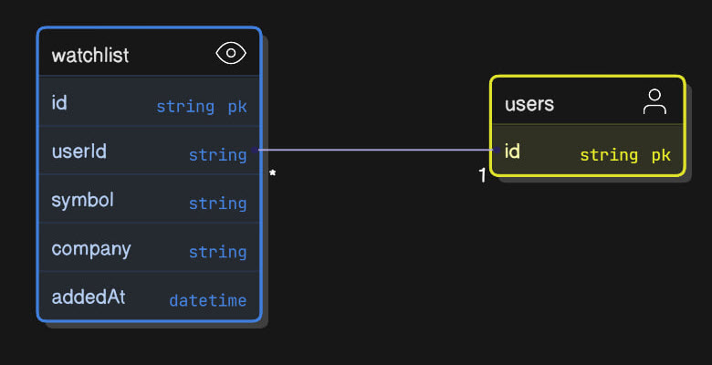

# Stock Tracker

## Description

Stock Tracker is a simple application designed to monitor and track stock prices in real-time. It fetches data from financial APIs and provides users with up-to-date information on stock performance, including price changes, historical data, and basic analytics.

This project is built with Next.js, Node.js, and integrates with MongoDB for data storage, Finnhub for stock data, and other services like Gemini and Nodemailer.

It aims to help users make informed decisions by providing easy access to stock market data.

## Features

- Real-time stock price tracking
- Historical data visualization (charts)
- Portfolio management
- Alerts for price changes
- Support for multiple stock exchanges
- User-friendly interface

[Site](https://stock-tracker-sxidsvit.vercel.app/)

## Prerequisites

Before installing the application, ensure you have the following:

- Node.js (version 14 or higher) installed. You can download it from [nodejs.org](https://nodejs.org/).
- A package manager: npm (comes with Node.js) or Yarn.
- API keys and accounts for the following services:
  - MongoDB: Create a free account at [MongoDB Atlas](https://www.mongodb.com/cloud/atlas) and obtain a connection URI.
  - Finnhub: Sign up at [finnhub.io](https://finnhub.io/) to get an API key.
  - Google Gemini: Obtain an API key from [Google AI Studio](https://aistudio.google.com/) if using AI features.
  - Nodemailer: An email account (e.g., Gmail) for sending notifications.
  - Better Auth: Configure as per their documentation for authentication.

Make sure to have Git installed to clone the repository.

## Installation

To get started with Stock Tracker, follow these steps:

1. Clone the repository:
   ```
   git clone https://github.com/sxidsvit/stock-tracker.git
   ```
2. Navigate to the project directory:
   ```
   cd stock-tracker
   ```
3. Install dependencies:

   ```
   npm install  # or yarn install if using Yarn
   ```

4. Set up environment variables in `.env`

   ```
   NODE_ENV='development'
   NEXT_PUBLIC_BASE_URL=http://localhost:3000

   # MONGODB
   MONGODB_URI=

   # BETTER AUTH
   BETTER_AUTH_SECRET=
   BETTER_AUTH_URL=
   BETTER_AUTH_TELEMETRY=

   # GEMINI
   GEMINI_API_KEY=

   #NODEMAILER
   NODEMAILER_EMAIL=
   NODEMAILER_PASSWORD=

   # FINNHUB
   FINNHUB_BASE_URL=
   NEXT_PUBLIC_FINNHUB_API_KEY=
   ```

---

## 

---

## DB Structure

---



---

## Usage

Run the application in development mode:

```
npm start  # or yarn start
```

Access the app in your browser at `http://localhost:3000` (or the specified port).

To track a stock, enter the stock symbol (e.g., AAPL for Apple) in the search bar.

For production, build the app:

```
npm run build
```

# Contact

Connect with the project maintainer: [

Sergiy Antonyuk | LinkedIn

[linkedin]

[linkedin]: https://www.linkedin.com/in/sergiy-antonyuk/

For questions or feedback, open an issue on [GitHub](https://github.com/sxidsvit/ai-blog/issues)

#### 🙏 Acknowledgements

A heartfelt thank you to [JSMastery](https://www.youtube.com/@javascriptmastery/) for his invaluable contributions

---

_Built with ❤️ by [sxidsvit](https://github.com/sxidsvit)_

_Last updated: October 5, 2025_
